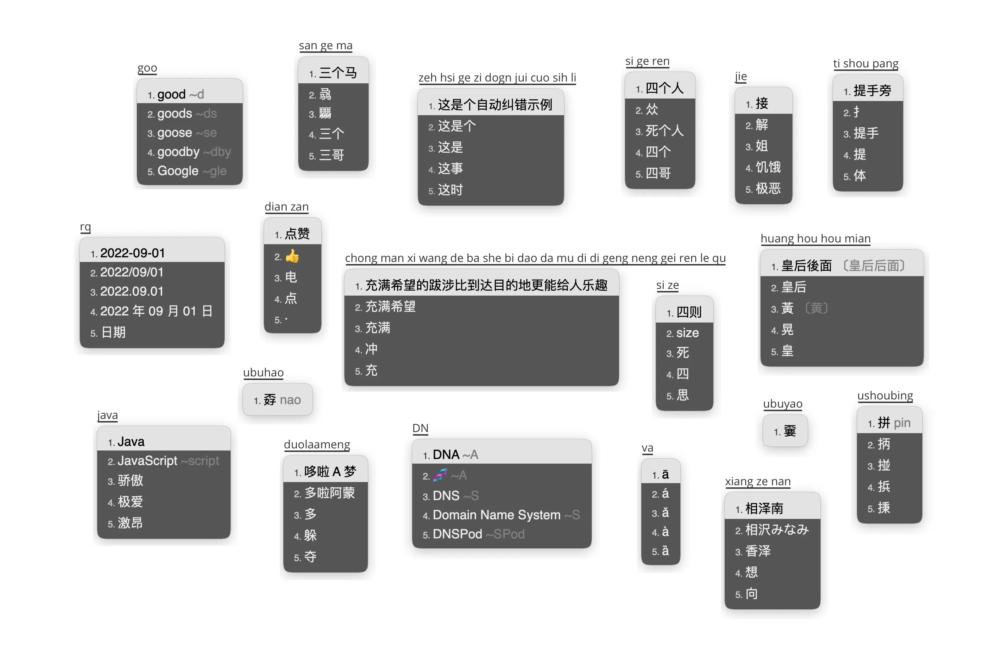

# 雾凇拼音

[](https://www.gnu.org/licenses/gpl-3.0.txt)
[](https://github.com/iDvel/rime-ice/releases/)
[](https://github.com/iDvel/rime-ice/actions/workflows/release.yml)




功能齐全，词库体验良好，长期更新修订。

<br>

[Rime Input Method Engine / 中州韵输入法引擎](https://rime.im/) 是一个跨平台的输入法算法框架。

这里是 Rime 的一份配置仓库，用户需要下载各平台对应的前端，并将此配置应用到配置目录。

雾凇拼音提供了一套开箱即用的完整配置，包含输入方案（全拼、常见双拼）、长期维护的开源词库及各项扩展功能。

详细介绍：[Rime 配置：雾凇拼音](https://dvel.me/posts/rime-ice/)

[常见问题](https://github.com/iDvel/rime-ice/issues/133)

[更新日志](./others/CHANGELOG.md)

<br>

## 基本套路

- 简体 | 全拼 | 双拼
- 主要功能
    -   轻量的英文输入，支持中英混输
    -   [优化英文输入体验](https://dvel.me/posts/make-rime-en-better/)
    -   拆字反查（<kbd>uU</kbd>+拼音），拆字辅码（拼音+<kbd>`</kbd>+拆字辅码）
    -   自整理的 Emoji
    -   以词定字（左右中括号：<kbd>[</kbd>、<kbd>]</kbd>）
    -   长词优先
    -   Unicode（<kbd>U</kbd>+Unicode 码位）
    -   数字、人民币大写（<kbd>R</kbd>+数字）
    -   日期、时间、星期（详见方案 `/date_translator` 节点）
    -   农历（转写：<kbd>N</kbd>+八位数字；获取当前农历：全拼<kbd>nl</kbd>，双拼<kbd>lunar</kbd>）
    -   简易计算器（<kbd>cC</kbd>+算式）
    -   常见错音错字提示
    -   置顶候选项（详见方案 `/pin_cand_filter` 节点）
    -   所有标点符号直接上屏
    -   特殊符号、字符输入（全拼<kbd>v</kbd>+首字母缩写；双拼<kbd>V</kbd>+首字母缩写）
    -   拼音纠错（模糊音）
    -   更多默认未启用的功能请参考 `lua/` 及方案注释
- 简体字表、词库
    -   [通用规范汉字表](https://github.com/iDvel/The-Table-of-General-Standard-Chinese-Characters)（by 中华人民共和国教育部）8K 常用汉字
    -   [Unihan 字库](https://www.unicode.org/Public/)（by Unicode lnc | [UNICODE LICENSE V3](https://www.unicode.org/license.txt)）40K 大字库， **默认未启用**
    -   [现代汉语常用词表](https://zh.wikipedia.org/wiki/%E7%8E%B0%E4%BB%A3%E6%B1%89%E8%AF%AD%E5%B8%B8%E7%94%A8%E8%AF%8D%E8%A1%A8)（by 中国国家语言文字工作委员会）
    -   [华宇野风词库](http://bbs.pinyin.thunisoft.com/forum.php?mod=viewthread&tid=30049)（by 野风）
    -   [简化字八股文](https://github.com/rime/rime-essay-simp)（by rime | [LGPL](https://github.com/rime/rime-essay-simp/blob/master/LICENSE)）
    -   [清华大学开源词库](https://github.com/thunlp/THUOCL)（by THUNLP | [MIT](https://github.com/thunlp/THUOCL/blob/master/LICENSE)）
    -   [腾讯词向量](https://ai.tencent.com/ailab/nlp/en/download.html)（@Huandeep [整理](https://github.com/iDvel/rime-ice/issues/24) | by Tencent AI Lab | [CC BY 3.0](https://creativecommons.org/licenses/by/3.0/)）
- 词库修订
    - 校对大量异形词、错别字、错误注音
    - 全词库完成注音
    - 同义多音字注音
    - 参考
      -   《现代汉语词典》
      -   《同义词词林》
      -   《新华成语大词典》
      -   [校对标准论坛](http://www.jiaodui.com/bbs/)
- Rime、Squirrel、Weasel 常用配置项的详尽注释

<br>

## 长期维护词库

因为没有找到一份比较好的词库，干脆自己维护一个。综合了几个不错的词库，精心调教了很多。

主要维护的词库：

- `8105` 字表。
- `base` 基础词库。
- `ext` 扩展词库，小词库。
- `tencent` 扩展词库，大词库。
- Emoji

维护内容主要是异形词、错别字的校对，错误注音的修正，缺失的常用词汇的增添，词频的调整。

欢迎在词库方面提 issue [#666](https://github.com/iDvel/rime-ice/issues/666) ，我会及时更新修正。

<br>

## 使用说明

### 选择和安装 RIME 前端

要使用雾凇拼音默认提供的所有功能，请保证
- 您的 RIME 前端提供的 librime 版本 ≥ 1.8.5 且
- 含有 librime-lua 依赖

以下是主流平台上的一些 RIME 前端安装建议。部分信息具有时效性，请以当下具体情况为准：

| 系统    | RIME 前端                                                    | 雾凇拼音版本要求                  | 备注                                                         |
| ------- | ------------------------------------------------------------ | --------------------------------- | ------------------------------------------------------------ |
| Android | [fcitx5-android](https://github.com/fcitx5-android/fcitx5-android/releases) + plugin.rime（小企鹅输入法） | ≥ 0.0.8                           | 暂不支持九宫格                                               |
| Android | [Trime](https://github.com/osfans/trime)（同文输入法）       | ≥ 3.2.11                          |                                                              |
| iOS     | [Hamster](https://apps.apple.com/cn/app/%E4%BB%93%E8%BE%93%E5%85%A5%E6%B3%95/id6446617683)（仓输入法） | N/A                               | 闭源；有内购                                                 |
| Linux   | ibus + [ibus-rime](https://github.com/rime/ibus-rime)        | librime ≥ 1.8.5 且装有 librime-lua | 部分发行版需手动安装 librime-lua                             |
| Linux   | fcitx5 + [fcitx5-rime](https://github.com/fcitx/fcitx5-rime) | librime ≥ 1.8.5 且装有 librime-lua | 部分发行版需手动安装 librime-lua                             |
| macOS   | [Squirrel](https://github.com/rime/squirrel)（鼠须管）       | ≥ 1.0.0                           | 0.16.0 - 0.18.0 版本请参考[🔗](https://github.com/iDvel/rime-ice/issues/1062) |
| macOS   | [fcitx5-macos](https://github.com/fcitx-contrib/fcitx5-macos) | N/A                               | 支持[卷轴模式](https://github.com/iDvel/rime-ice/issues/941) |
| Windows | [Weasel](https://github.com/rime/weasel)（小狼毫）           | ≥ 0.15.0                            | 0.14.3 可手动更新 [rime.dll](https://github.com/iDvel/rime-ice/issues/197)（但不支持彩色 emoji）<br />Weasel 当下有兼容性问题，建议安装其他输入法备用 |

Linux 依赖问题的具体解释请参考 [#840](https://github.com/iDvel/rime-ice/issues/840)。

雾凇拼音的部分配置可能要求更高的 librime 或者客户端版本，这些功能已在具体配置文件中注明。

以下安装方式，选择其一：

- [手动安装](#手动安装)
- [Git 安装](#git-安装)
- [东风破 plum](#东风破-plum)
- [自动部署脚本](#自动部署脚本)
- [仓输入法](#仓输入法-hamster)
- [Arch Linux](#arch-linux)（AUR）

### 手动安装

您可以将仓库打包下载，将所有文件复制粘贴到 RIME 前端的配置目录，重新部署。

只需要使用或者更新词库的话，可以手动粘贴覆盖 `cn_dicts` `en_dicts` `opencc` 三个文件夹。

> [!NOTE]
> 雾凇拼音中多个文件可能与其他方案同名冲突，如果是新手想一键安装，建议备份原先配置，**清空配置目录**再导入。

> [!NOTE]
>
> 单独使用词库注意事项：`rime_ice.dict.yaml` 下面包含了大写字母，这和配置有些许绑定，可以直接删除，详细说明：[#356](https://github.com/iDvel/rime-ice/issues/356)

您也可以前往 [Release](https://github.com/iDvel/rime-ice/releases) 界面，下载特定版本的词典文件（具体描述见 Release 说明），覆盖配置目录的对应文件。

### Git 安装

您如果熟悉 git 常用操作，可以使用 git clone 命令将本仓库克隆到对应前端的用户目录。由于本库提交历史较多且更改频繁，添加 `--depth` 参数可以显著减少传输体积。

```bash
git clone https://github.com/iDvel/rime-ice.git Rime --depth 1

# 更新
cd Rime
git pull
```

通过 checkout 命令，您也可以实现更新部分文件的效果。

### 东风破 [plum](https://github.com/rime/plum)

选择配方（`others/recipes/*.recipe.yaml`）来进行安装或更新。

<details>
<summary>/plum/ 简易安装和使用教程</summary>

---

安装 plum（仅需要执行一次）
```bash
# 请先安装 git 和 bash，并加入环境变量
# 请确保和 github.com 的连接稳定
cd ~
git clone https://github.com/rime/plum.git plum
# 卸载 plum 只需要删除 ~/plum 文件夹即可
```

更新 plum
```bash
cd ~/plum
bash rime-install plum
```

使用 plum 安装「雾凇拼音」方案的韵书（recipe）
```bash
cd ~/plum
bash rime-install iDvel/rime-ice:others/recipes/full
```

指定 RIME 前端为 fcitx5-rime

```bash
cd ~/plum
rime_frontend=fcitx5-rime bash rime-install iDvel/rime-ice:others/recipes/full
```

使用 plum 更新「雾凇拼音」的词库文件

```sh
cd ~/plum
bash rime-install iDvel/rime-ice:others/recipes/all_dicts
```

---
</details>

词库配方只是更新具体词库文件，并不更新 `rime_ice.dict.yaml` 和 `melt_eng.dict.yaml`，因为用户可能会挂载其他词库。如果更新后部署时报错，可能是增、删、改了文件名，需要检查上面两个文件和词库的对应关系。

℞ 安装或更新全部文件

```
bash rime-install iDvel/rime-ice:others/recipes/full
```

℞ 安装或更新所有词库文件（包含下面三个）

```
bash rime-install iDvel/rime-ice:others/recipes/all_dicts
```

℞ 安装或更新拼音词库文件（ `cn_dicts/` 目录内所有文件）

```
bash rime-install iDvel/rime-ice:others/recipes/cn_dicts
```

℞ 安装或更新英文词库文件（ `en_dicts/` 目录内所有文件）

```
bash rime-install iDvel/rime-ice:others/recipes/en_dicts
```

℞ 安装或更新 opencc （ `opencc/` 目录内所有文件）

```
bash rime-install iDvel/rime-ice:others/recipes/opencc
```

下面这个配方会在 `radical_pinyin.custom.yaml` 和 `melt_eng.custom.yaml` 里将 `speller/algebra` 修改为对应的双拼拼写，选择一个自己使用的双拼作为参数。

℞ 双拼补丁

```
bash rime-install iDvel/rime-ice:others/recipes/config:schema=flypy
bash rime-install iDvel/rime-ice:others/recipes/config:schema=double_pinyin
bash rime-install iDvel/rime-ice:others/recipes/config:schema=mspy
bash rime-install iDvel/rime-ice:others/recipes/config:schema=sogou
bash rime-install iDvel/rime-ice:others/recipes/config:schema=abc
bash rime-install iDvel/rime-ice:others/recipes/config:schema=ziguang
```

℞ 下载特定版本的配置

在仓库后加 `@tag` 即可，例如：

```sh
bash rime-install iDvel/rime-ice@2024.05.21:others/recipes/full
```

### 仓输入法 [Hamster](https://github.com/imfuxiao/Hamster)

参考 [如何导入"雾凇拼音输入方案"](https://github.com/imfuxiao/Hamster/wiki/%E5%A6%82%E4%BD%95%E5%AF%BC%E5%85%A5%22%E9%9B%BE%E6%B7%9E%E6%8B%BC%E9%9F%B3%E8%BE%93%E5%85%A5%E6%96%B9%E6%A1%88%22)

仓输入法目前已内置雾凇拼音，也可以通过【输入方案设置 - 右上角加号 - 方案下载 - 覆盖并部署】来更新雾凇拼音。

使用九宫格，需要同时启用九宫格方案（输入方案设置）和九宫格布局（键盘设置 - 键盘布局 - 中文 9 键）。

### 自动部署脚本

[Mark24Code/rime-auto-deploy](https://github.com/Mark24Code/rime-auto-deploy) 一个自动部署脚本，集成了雾凇拼音，帮助无痛快速安装、部署 Rime 输入法（中州韵、小狼毫，鼠须管）以及部署配置。

### Arch Linux

使用 AUR helper 安装 [rime-ice-git](https://aur.archlinux.org/packages/rime-ice-git) 包即可。

```bash
# paru 默认会每次重新评估 pkgver，所以有新的提交时 paru 会自动更新，
# yay 默认未开启此功能，可以通过此命令开启
# yay -Y --devel --save

paru -S rime-ice-git
# yay -S rime-ice-git
```

推荐使用[补丁](https://github.com/rime/home/wiki/Configuration#補靪)的方式启用。

参考下面的配置示例，修改对应输入法框架用户目录（见下）中的 `default.custom.yaml` 文件

- iBus 为 `$HOME/.config/ibus/rime/`
- Fcitx5 为 `$HOME/.local/share/fcitx5/rime/`

<details>
<summary>default.custom.yaml</summary>

```yaml
patch:
  # 仅使用「雾凇拼音」的默认配置，配置此行即可
  __include: rime_ice_suggestion:/
  # 以下根据自己所需自行定义，仅做参考。
  # 针对对应处方的定制条目，请使用 <recipe>.custom.yaml 中配置，例如 rime_ice.custom.yaml
  __patch:
    key_binder/bindings/+:
      # 开启逗号句号翻页
      - { when: paging, accept: comma, send: Page_Up }
      - { when: has_menu, accept: period, send: Page_Down }
```

</details>

<br>

## 感谢 ❤️

特别感谢上文已经提及的词库、词典的作者、贡献者及整理者；特别感谢以及下列词库、方案、脚本的作者及贡献者（提及的均为 GitHub id）：

- @mozillazg 开发的汉字转拼音工具和数据库（MIT）
- [melt_eng](https://github.com/tumuyan/rime-melt)（@tumuyan | [Apache 2.0](https://github.com/tumuyan/rime-melt/blob/master/LICENSE)） ：提供了部分（约 1000 条）英文词汇以及原始英文方案参考；
- [部件拆字方案](https://github.com/mirtlecn/rime-radical-pinyin)（@mirtlecn | [GPL 3.0](https://github.com/mirtlecn/rime-radical-pinyin/blob/master/LICENSE)）：提供的拆字反查和候选筛选插件；
- [长词优先插件](https://github.com/tumuyan/rime-melt/blob/master/lua/melt.lua)（@tumuyan | [Apache 2.0](https://github.com/tumuyan/rime-melt/blob/master/LICENSE)）
- [Unicode 插件](https://github.com/shewer/librime-lua-script/blob/main/lua/component/unicode.lua)（@shewer | [MIT](https://github.com/shewer/librime-lua-script/blob/main/lua/component/unicode.lua)）
- [数字、人民币大写插件](https://github.com/yanhuacuo/98wubi/blob/master/lua/number.lua)（@98wubi）
- [农历插件](https://github.com/boomker/rime-fast-xhup)（@boomker | [LGPL 3.0](https://github.com/boomker/rime-fast-xhup/blob/master/LICENSE)）
- 未能在此处详述的、在本库源码注释中提及的项目及作者给予的帮助和参考

感谢 [@Huandeep](https://github.com/Huandeep) 整理的多个词库。

感谢 [@Mirtle](https://github.com/mirtlecn) 完善的多个功能。

感谢所有贡献者。

<!-- 搜狗转 Rime：[lewangdev/scel2txt](https://github.com/lewangdev/scel2txt) -->

Thanks to JetBrains for the OSS development license.

[](https://jb.gg/OpenSourceSupport)

<br>

## 赞助 ☕

如果觉得项目不错，可以请 Dvel 吃个煎饼馃子。


