# 雾凇拼音

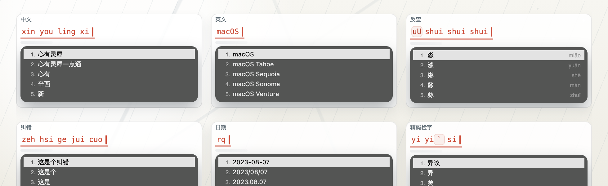

**雾凇拼音**是一份开箱即用的简体中文 Rime 输入法配置，词库长期维护，基本功能齐全，使用完全离线，质量稳定可靠。

雾凇拼音包含全拼和双拼输入方案、长期维护的精校词库、各类扩展功能和详尽的注释。适配小狼毫 Weasel、鼠须管 Squirrel、Fcitx5、iBus 等几乎所有 Rime 前端。你可以不折腾，一键下载部署后即刻使用；可以借着完善的注释和社区生态，让 AI 帮你定制改造；也可以将之作为深入了解和自定义 Rime 的起点。

使用雾凇拼音，享受跨平台一致、隐私友好、个性化门槛低的 Rime 简体中文输入体验。

[立即下载安装](#安装) | [功能演示和教程](#功能演示和使用教程) | [常见问题](#常见问题) | [词库共建](https://github.com/iDvel/rime-ice/issues/666) | [更新日志](./others/docs/Changelog.md) | [详细介绍](https://dvel.me/posts/rime-ice/) ↗ | [在线体验](https://www.mintimate.cc/zh/demo/fcitx5Online.html)[^1] ↗


## 安装

到 Rime [官网](https://rime.im/) 或 app 商店下载安装 Rime 输入法应用。然后：

1. 下载 [雾凇拼音](https://github.com/iDvel/rime-ice/releases/latest/download/full.zip)；
2. 解压，复制并覆盖所有文件到输入法的「用户目录」；
3. 重新部署。

部署完成后就可以打字了。按 <kbd>F4</kbd> 可以切换输入方案或开关各项功能。重做以上三步可以更新/还原雾凇拼音。

也可以使用 [/plum/](https://github.com/rime/plum) ℞ 配方管理工具，一行命令就能安装和更新雾凇拼音：

```bash
bash rime-install iDvel/rime-ice
```

了解更多细节以及其他支持的安装方式，参考 [详细安装指导](./others/docs/Installation.md)。

## 介绍

雾凇拼音包含：

1. 为简体中文设计的全拼和常见双拼方案，包括雾凇拼音（全拼）、智能 ABC、自然码、小鹤双拼、搜狗双拼、微软双拼、紫光双拼、拼音加加、9 键[^2] 和轻量的英文方案。
2. 长期维护、精心调教且开源的百万中英词库：[了解 >](#长期维护的中英词库)
3. 完善的基础输入体验，以及丰富的扩展功能：[了解 >](#功能演示和使用教程)
4. 对 Rime 部分及主流前端每一项配置的详细注释，方便学习和自定义：[示例 >](./default.yaml)

### 长期维护的中英词库

因为没有找到一份比较好的词库，干脆自己维护一个。综合了几个不错的词库，精心调教了很多。

词库简介：

- 字表：
  - `8105` 常用字表，《通用规范汉字表》+基本的扩充。
  - `41448` Unihan 大字表，默认未启用。
- 词库：
  - `base` 基础词库，含两字词及调频。
  - `ext` 扩展词库，小词库，含多音字注音。
  - `tencent` 扩展词库，大词库，无注音（由 Rime 自动注音），含非多音字、只发一种音的多音字、同义多音字。
- 纯手搓的 Emoji
- 英文词库：
  - `en` 20k 左右的常见单词 + 少许补充。
  - `en_ext` 扩展词库，大部分是缩写或互联网相关。

维护内容主要是异形词、错别字的校对，错误注音的修正，缺失的常用词汇的增添，词频的调整。欢迎在词库方面提 [issue](https://github.com/iDvel/rime-ice/issues/666)，我会及时更新修正。

### 功能演示和使用教程

<h4 align="center"><strong>—— ⌨️ 基础输入 ⌨️ ——</strong></h4>

| **1. 方案选单** | **2. 中文输入** |
| -------- | -------- |
| 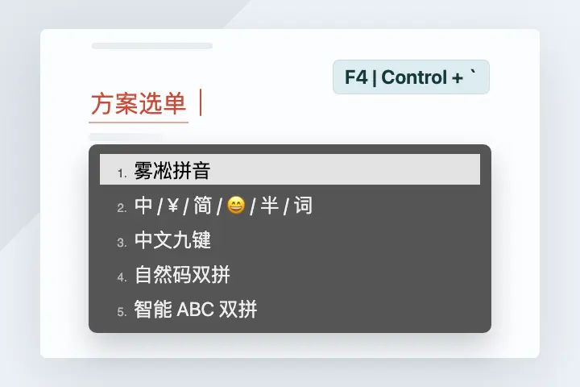 | 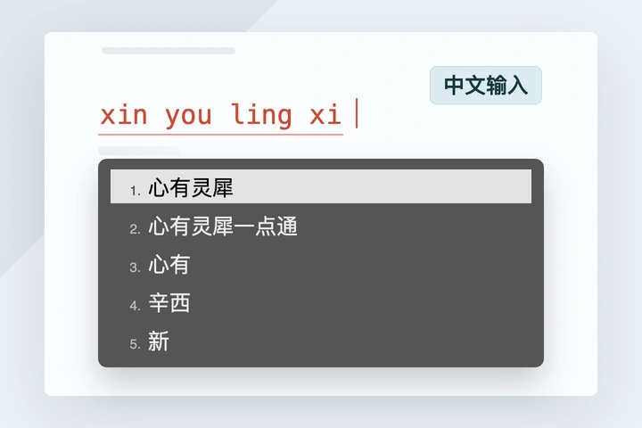 |

| **3. 英文输入** | **4. 中英混合输入** |
| -------- | -------- |
| 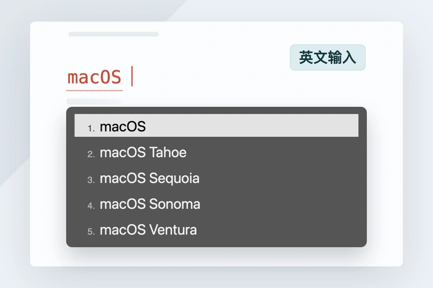 |  |

| **5. Emoji** | **6. 模糊音** |
| -------- | -------- |
| 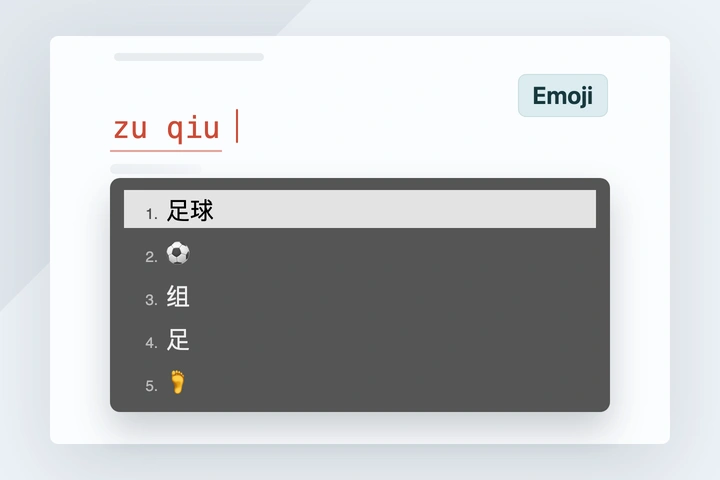 | 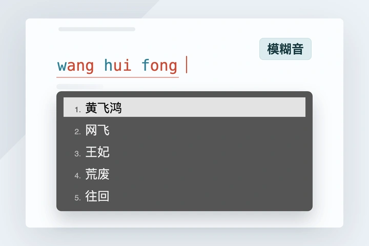 |

| **7. 自动纠错** | **8. 繁简转换** |
| -------- | -------- |
| 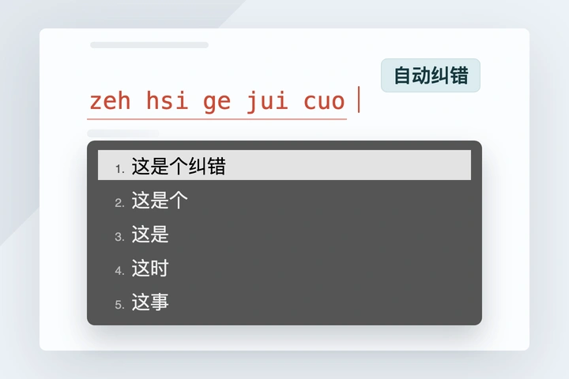 | 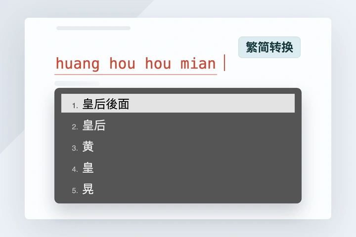 |

<br>

<h4 align="center"><strong>—— 🔍 反查和符号 🔍 ——</strong></h4>

| **1. 拆字反查** | **2. 数字符号转写** |
| ---- | ---- |
| 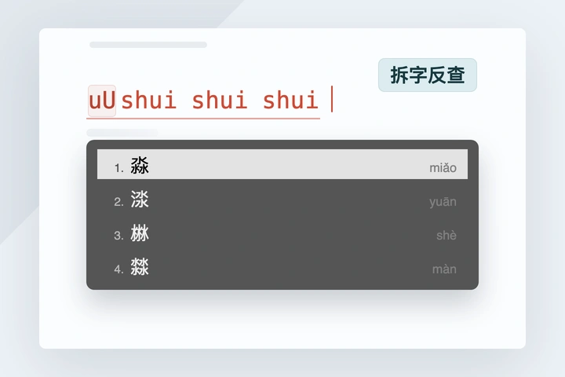 | 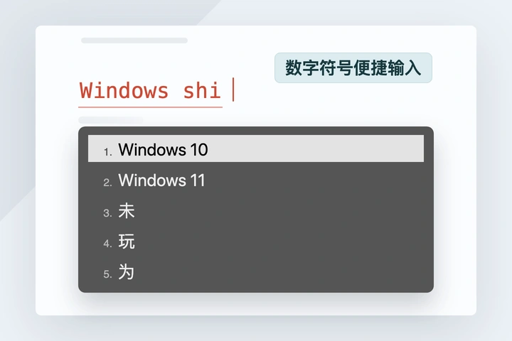 |
| 碰到生僻字，输入 <kbd>uU</kbd> + 字的部件拼音，得到汉字和注音 | 用拼音、英文输入短语中的数字和符号 |

| **3. 符号输入** | **4. 词汇别名** |
| ---- | ---- |
| 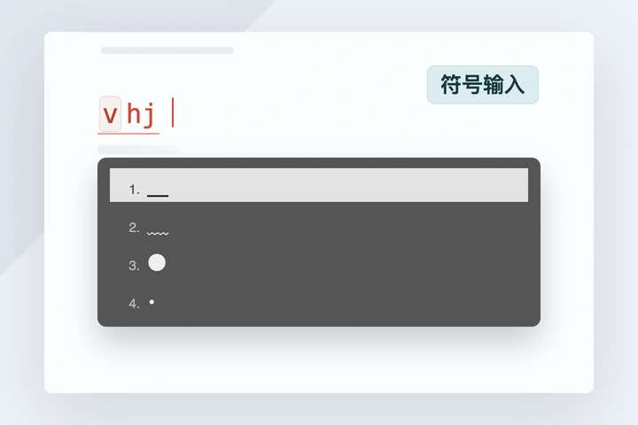 | 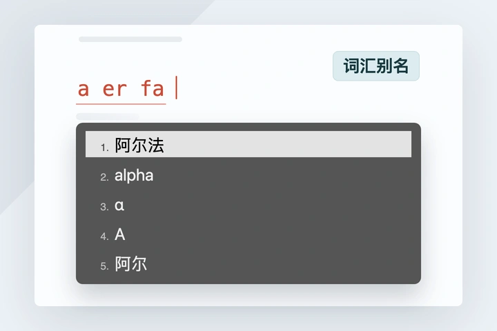 |
| 全拼 <kbd>v</kbd> + 拼音首字母；双拼 <kbd>V</kbd> + 拼音首字母 | 部分常用词，自动展示其翻译、别名、化学式、简称等 |

<br>

<h4 align="center"><strong>—— ✨ 扩展功能 ✨ ——</strong></h4>

| **1. 以词定字** | **2. 辅码检字** |
| ---- | ---- |
| 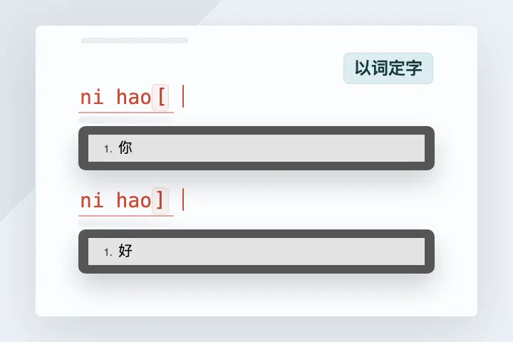 | 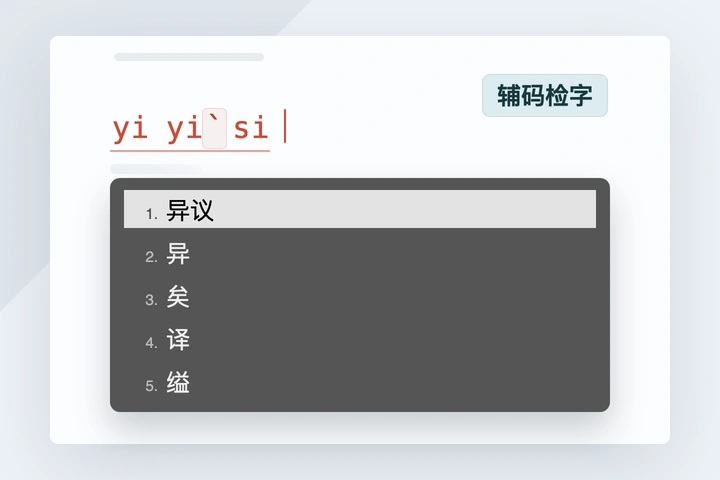 |
| 用左右中括号键，输入候选的开头或末尾的字 | 输入拼音后，再输入 <kbd>`</kbd> + 字的偏旁部首拼音，筛选候选 |

| **3. 错字错音提示** | **4. 英文自动大小写** |
| -------- | -------- |
| 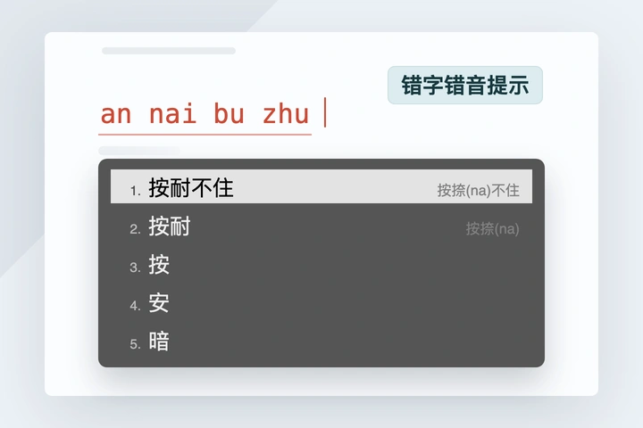 | 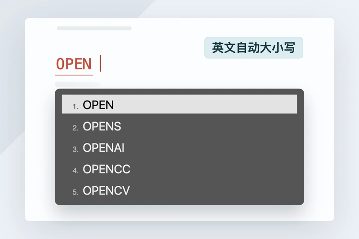 |
| 输了错字错音，雾凇会提示正确的音形 | 大写开头，得到首字母大写的单词；多个大写字母开头，得到全大写的单词 |

| **5. 日期输入** | **6. 农历输入** |
| -------- | -------- |
| 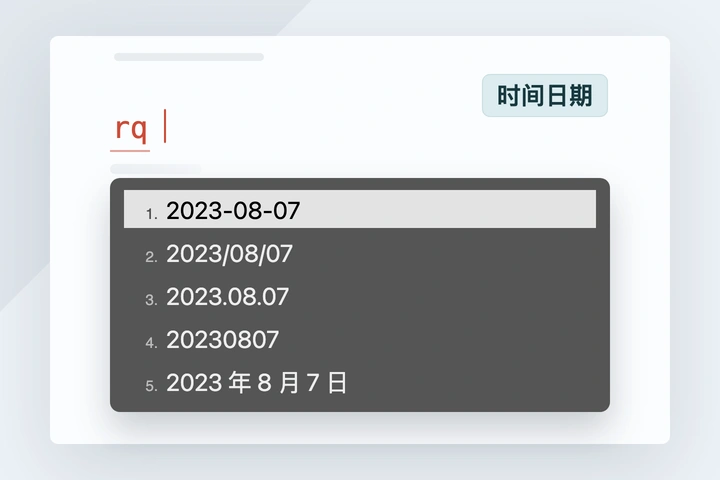 | 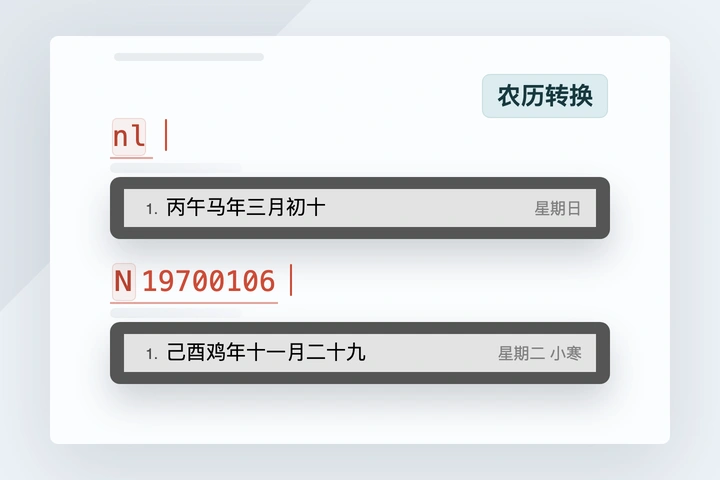 |
| 全拼输 <kbd>rq</kbd>，双拼输 <kbd>date</kbd>，得到各种格式的当前日期和时间 | 全拼输 <kbd>nl</kbd>，双拼输 <kbd>lunar</kbd>，获取当前农历；输入 <kbd>N</kbd> + 日期，获取指定日期农历和节气 |

<br>

<h4 align="center"><strong>—— 🧰 便捷工具 🧰 ——</strong></h4>

| **1. 计算器** | **2. Unicode 输入** |
| ---- | ---- |
| 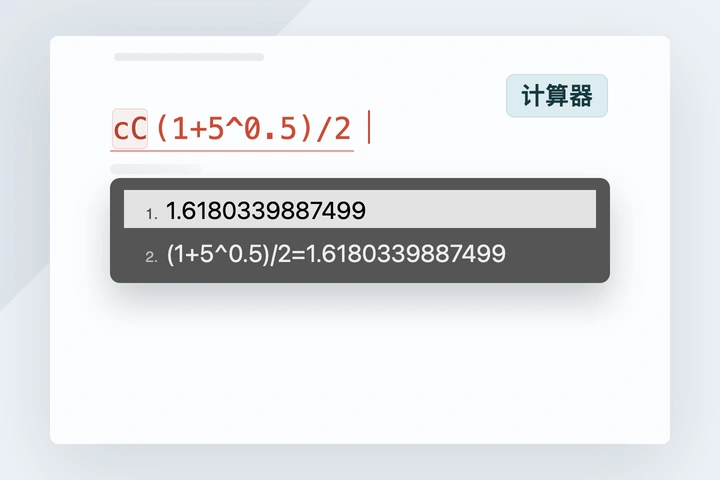 | 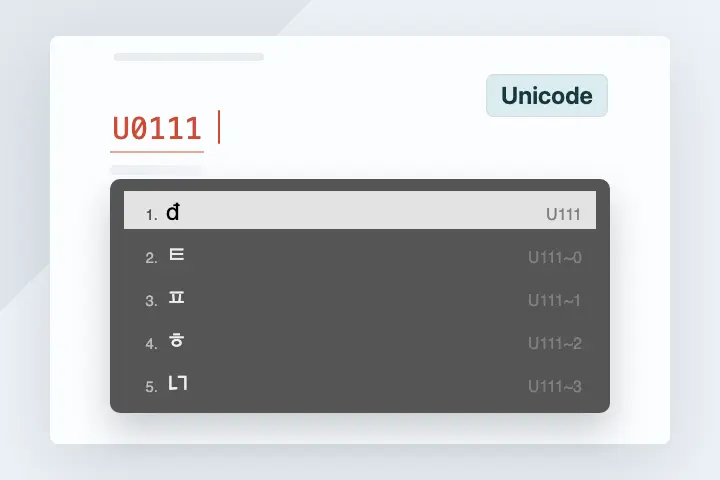 |
| 输入 <kbd>cC</kbd> 后加上算式，得到计算结果 | 输入 <kbd>U</kbd> + Unicode 编码，得到对应字符 |

| **3. UUID 生成** | **4. 数字货币转写** |
| ---- | ---- |
| 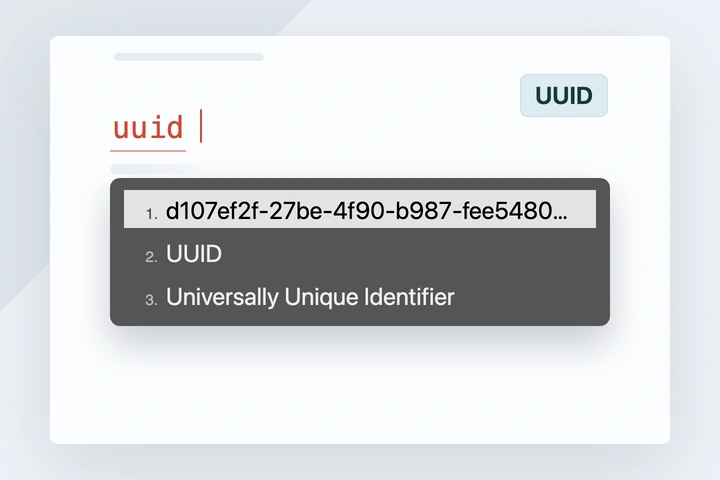 | 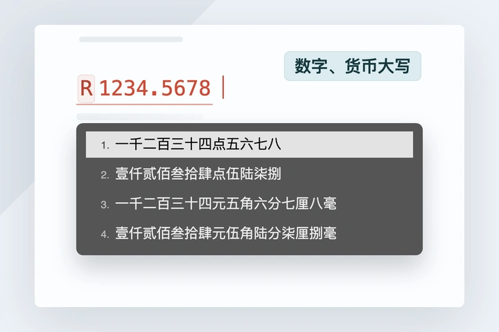 |
| 输入 <kbd>uuid</kbd>，得到一个随机生成的 UUID | 输入 <kbd>R</kbd> + 数字，自动转写为数字大写或者人民币大写 |

功能快捷键和行为定制，以及更多其他功能，请参考 lua 文件和方案文件中的注释。

## 鸣谢

- [这些项目和脚本](./others/docs/Credits.md) 为雾凇拼音提供的支持和参考。
- [校对标准论坛](http://www.jiaodui.org/bbs/) 的存在。
- [@Huandeep](https://github.com/Huandeep) 整理的多个词库。
- [@Mirtle](https://github.com/mirtlecn) 完善的多个功能。
- [@Lithium-7](https://github.com/Lithium-7) 对词库的大量修订。

Thanks to JetBrains for the OSS development license.

[](https://jb.gg/OpenSourceSupport)

## 常见问题

<details>
<summary>🛠️ 怎么修改雾凇拼音的配置</summary>

可以根据注释，直接在文件上修改，这样修改也简单，适合初次尝试。但注意，这会在更新后被覆盖掉。

熟悉后，推荐使用 [打补丁的方式](https://dvel.me/posts/rime-ice/#%E4%BB%A5-patch-%E7%9A%84%E6%96%B9%E5%BC%8F%E6%89%93%E8%A1%A5%E4%B8%81) 来覆盖原配置的选项，不修改仓库中已有的文件，这样可放心全量拉取更新，通过 plum 或 git pull 时不用担心由于更新文件导致自定义的配置被覆盖。

</details>

<details>
<summary>⌨️ 双拼怎么添加自定义短语，怎么让拆字/英文的编码支持双拼</summary>

相对于全拼，双拼的一些配置有所不同：

- 双拼的自定义短语文件默认为 `custom_phrase_double.txt`，需要手动创建。
- 英文方案 `melt_eng.schema.yaml` 中有一些不通用的派生规则，默认启用的是全拼的。
- 部件拆字方案 `radical_pinyin.schema.yaml` 的反查和辅码，有一些不通用的派生规则，默认启用的是全拼的。
- 双拼是显示全拼编码还是双拼编码？比如小鹤双拼输入 `zz` 时，是显示 `zz` 还是 `zou`，默认是转换为全拼编码。`translator` 下的 `preedit_format` 属性会影响输入框和 Shift+回车时的显示，删除这部分就不转换。

双拼可以直接用 plum 自动打补丁，也可以手写，下面以小鹤双拼方案 `double_pinyin_flypy.schema.yaml` 为例。

（补丁放到仓库里了 [others/双拼补丁示例](https://github.com/iDvel/rime-ice/tree/main/others/%E5%8F%8C%E6%8B%BC%E8%A1%A5%E4%B8%81%E7%A4%BA%E4%BE%8B)）

1. 创建 `melt_eng.custom.yaml` 修改英文派生规则：

```yaml
patch:
  # 修改为小鹤双拼的拼写派生规则，因为不在同一个文件了，前面要加上文件名
  speller/algebra:
    __include: melt_eng.schema.yaml:/algebra_flypy
```

2. 创建 `radical_pinyin.custom.yaml` 修改反查及辅码派生规则：

```yaml
patch:
  # 修改为小鹤双拼的拼写派生规则，因为不在同一个文件了，前面要加上文件名
  speller/algebra:
    __include: radical_pinyin.schema.yaml:/algebra_flypy
```

3. （按需选择）创建 `double_pinyin_flypy.custom.yaml`：

```yaml
patch:
  # （按需选择）清空 preedit_format 中的内容，输入时显示双拼编码
  translator/preedit_format: []
```

</details>

<details>
<summary>🔀 能实现全拼双拼混输吗</summary>

参考：<https://dvel.me/posts/rime-full-pinyin-double-pinyin-mixed-input/>

</details>

<details>
<summary>🚫 xx 字打不出来 / xx 读音没有</summary>

可能为生僻字，请尝试开启大字表。若确实为常用字（如常见于人名、物品名、术语），请 PR 或在 #666 补充。

</details>

<details>
<summary>🔲 部分候选项变成豆腐块、方块、问号</summary>

系统缺少相关字体导致。请尝试下载或更换显示字体。

关于部分生僻字，参考 <https://github.com/iDvel/rime-ice/issues/841> 的推荐。

- [MiSans + MiSans L3](https://hyperos.mi.com/font/zh/rare-word/)
- [遍黑体](https://github.com/Fitzgerald-Porthmouth-Koenigsegg/Plangothic-Project)
- 花园明朝

Windows 10 平台部分 Emoji 用系统默认字体无法显示，请尝试下载 [Noto Color Emoji](https://fonts.google.com/noto/specimen/Noto+Color+Emoji) 或用 Windows 11 Emoji 字体替换。

</details>

<details>
<summary>⚠️ 部署失败或者报错</summary>

如果缩进错误，或用了 Tab，可能部署时并不会报错，而是自动加载默认配置。

如果发现方案选单里是朙月拼音，打的是繁体，那可能是配置有问题，Rime 自动加载了默认配置，检查一下修改过的地方。

配置错误也可能导致 `default.yaml` 文件被移入 `trash/` 目录，你需要移动回来，改好后重新部署，然后可以直接删除 `trash/` 目录。

</details>

<details>
<summary>🔄 中英文、大小写切换行为如何修改</summary>

Shift 是否切换中英，切换时的行为等等，参考 `default.yaml` 中 `ascii_composer` 下的详细注释。

</details>

<details>
<summary>📝 怎么修改标点符号映射</summary>

标点符号相关配置在 `default.yaml` 中定义，再在多个方案中引用。

修改 `default.yaml` 或在 `default.custom.yaml` 中打补丁即可全局修改。

</details>

<details>
<summary>🎨 怎么设置皮肤横向竖向排列</summary>

皮肤配置不通用，要参考各前端自己的配置方式。

小狼毫由 `style/horizontal` 属性决定：

```yaml
patch:
  "style/horizontal": true  # true 横向 | false 竖向
```

鼠须管的 `horizontal` 属性已经弃用，在 `squirrel.yaml` 皮肤的选项中使用以下两个属性：

```yaml
preset_color_schemes:
  皮肤名:
    candidate_list_layout: stacked  # stacked | linear  候选项排列方向
    text_orientation: horizontal    # horizontal | vertical  文字排列方向
```

⚠️ 注意具体皮肤的优先级比 `style` 的高。

鼠须管效果展示：


</details>

<details>
<summary>📌 怎么自定义短语</summary>

自定义短语用 Tab 分割词汇、编码、权重。

`custom_phrase.txt` 中是我自己的习惯，仅供参考，这个每个人的习惯都不一样，可以换成自己的。

可以新建一个文件，并在方案的 `custom_phrase/user_dict:` 下指定使用哪个文件。

</details>

<details>
<summary>💱 怎么设置台湾繁体</summary>

默认 OpenCC 的选项 `traditionalize/opencc_config: s2t.json` 是香港繁体。

台湾繁体有以下两种方式供参考，先修改为 `s2tw.json`：

- 参考 #291，修改 opencc
- 参考 #575，补加一个 t2tw
    （因为不知道什么原因，`s2tw.json` 选项并没有真正转换为台湾繁体，所以又补了一个 `t2tw.json`）
    （librime 1.10 已修复，新版本不再需要折腾了。）

</details>

<details>
<summary>😀 可以支持颜文字吗？</summary>

没有加入颜文字，可参考 #920。

</details>

<details>
<summary>🐧 Linux 系统无候选 & 雾凇拼音候选后出现拼音注释等</summary>

输入 `rq`（双拼是 `date`），如若没有出现当前日期，则表示 Lua 没有成功加载，您就可能遇到上述问题。

请确保你已经正确安装了 librime 包，并以插件或其他形式安装了其依赖包 librime-lua（部分发行版——特别是红帽系——需要手动安装）；如果仍存在问题，或者你无法判断是否达成此条件，请：

- 若使用 fcitx 框架，请改用其继承者 fcitx5；若使用 fcitx5 框架，请保证安装的是 **fcitx5-rime** 而非 ~~fcitx-rime~~
- 若使用 ibus 框架，出现意外，可以考虑使用 [AppImage](https://github.com/hchunhui/ibus-rime.AppImage)，以跟进 librime 更新
- 若使用 fcitx5 框架，出现意外，请考虑使用 [Flatpak](https://flathub.org/apps/org.fcitx.Fcitx5)，参考 Fcitx5 官方 [wiki](https://fcitx-im.org/wiki/Install_Fcitx_5#Install_Fcitx_5_from_Flatpak)

AppImage 和 Flatpak 可以确保没有依赖问题。

请参考：<https://github.com/iDvel/rime-ice/issues/840>

</details>

<details>
<summary>🐧 Linux Fcitx5 首次安装雾凇拼音后，无法输入</summary>

请尝试修改任意 yaml 文件，再重新部署 Rime，不要仅依赖重启输入法框架。

请参考 <https://github.com/iDvel/rime-ice/issues/1439>

</details>

<details>
<summary>🌙 怎么添加或修改 Lua？</summary>

做好自己的 Lua 放在 `lua/` 文件夹内，使用[新版 librime-lua 引入模块的方式](https://github.com/hchunhui/librime-lua/wiki/Scripting#%E6%96%B0%E7%89%88-librime-lua)，不用修改 `rime.lua`：

```yaml
- lua_translator@*my_translator  # 多了一个星号
```

比如想将自己修改后的 `new_date_translator.lua` 替换掉 `date_translator`：

```yaml
# 方式一、复制完整的 translators 的内容过来
patch:
  engine/translators:
    # 。。。
    - lua_translator@*new_date_translator  # 将此处替换为自己的 Lua
    # 。。。

# 方式二、仅替换修改项，但依赖于原始排序（从 0 开始数），如果排序变动就替换错了
patch:
  engine/translators/@2: lua_translator@*new_date_translator
```

</details>

<details>
<summary>📋 我看到了日志里面的 WARNING</summary>

WARNING 日志仅为警告，一般可以忽视。ERROR 文件若有日志，则需要留神。

```
accessing blocking node with unresolved dependencies:
```

这是因为 melt_eng 和 radical_pinyin 引用了自身的节点，RIME build 时认为这可能会导致引用了一个未编译完成的文件，因而抛出警告。无视即可。

```
duplicate definition:
```

因为某些词典有重复的条目，build 时 RIME 认为这可能会造成编码和权重的覆写，因而抛出警告，无视即可。

</details>

## 许可证

GPL-3.0 (only) License.

## 赞助

如果觉得项目不错，可以请 Dvel 吃个煎饼馃子。


[^1]: 由 @Mintimate 友情构建
[^2]: 九键方案仅适用于 iOS 平台的特定软件
